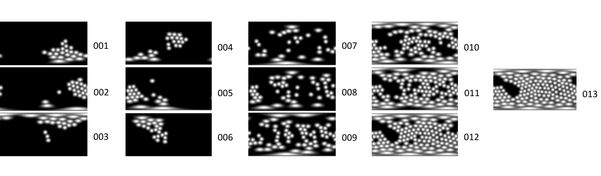

# OpenIllumination

This repository contains code for pre-processing data captured the light stage, including camera parameter restoration, image undistortion, and object segmentation, and light calibration for object-centric task, as well as TensoIR pipeline on the captured dataset. 
This repository is used to process data in the paper "OpenIllumination: A Multi-Illumination Dataset for Inverse Rendering Evaluation on Real Objects", which introduces a real-world dataset containing over 108K images of 64 objects captured under 72 camera views and a large number of different illuminations. This dataset enables the quantitative evaluation of most inverse rendering and material decomposition methods for real objects. This dataset contains various everyday objects, including decoration sculptures, toys, foods, etc., and does not include human beings.

## Browse the content of the dataset
To browse the content of the dataset in an interactive webpage, after cloning the repository to your local machine, open a python `http-server` under this repository folder
```
cd multiview_brdf_capture/annonymous2023neuripsdataset.github.io
python -m http.server 8000
```
You can view the page through `http://localhost:8000`


## Requirements

- Ubuntu 18.04+ **with a display for label segmentation**
- Python 3.7+
- Nvidia GPU

## License

See the [LICENSE](LICENSE) file for license rights and limitations (MIT).

## Instruction

### 1. Preparation

#### a) Creating environment

```
cd OpenIllumination
conda env create -n openillumination
conda activate openillumination
conda install pytorch torchvision torchaudio pytorch-cuda=11.7 -c pytorch -c nvidia
conda install -c fvcore -c iopath -c conda-forge fvcore iopath -y
conda install pytorch3d -c pytorch3d -y
pip install -r requirements.txt
sh install.sh
```

#### b) Install COLMAP

Follow the instruction [here](https://colmap.github.io/install.html#build-from-source).

#### c) Download the segmentation models

```bash
bash scripts/download_segm_models.sh
```

### 2. Capture images

a) Capture images using the light stage and organize the data like below.

```bash
DATASET_ROOT 
├─ greenhead/DSLR_3D__greenhead # for camera calibration
│  │  ├─ CA2.JPG
│  │  ├─ CA4.JPG
│  │  ├─ ...
├─ paper_egg # image directory
│  ├─ 001__1__... # the first illumination
│  │  ├─ CA2.JPG
│  │  ├─ CA4.JPG
│  │  ├─ ...
│  ├─ 002__2__... # the second illumination
│  │  ├─ CA2.JPG
│  │  ├─ CA4.JPG
│  │  ├─ ...
│  ├─ ...
```
b) Create a directory for the processed data.
```bash
mkdir OUTPUT_DIR
```
c) Copy the images for camera calibration.
```bash
mkdir OUTPUT_DIR/calibration/images -p
cp DATASET_ROOT/${GREENHEAD_DIR}/*.JPG OUTPUT_DIR/calibration/images/
python ltsg/module/calibration.py --data_dir OUTPUT_DIR/calibration --normalize_camera_poses
```
d) Run the following command to reformat images of other objects.

```bash
python tools/reformat_data_dslr.py --input_dir DATASET_ROOT --output_dir OUTPUT_DIR --calibration_dir OUTPUT_DIR/calibration
```


### 3. Light calibration

Since we have performed light calibration before, you can use the pre-calibrated results and skip this step.

```bash
python tools/light_calib/light_calib.py
```

### 4. Data post-processing 

Take images captured by DSLR as an exmple, run the following command to perform camera calibration, image undistortion, and segmentation. Note that this step requires a display if you use SAM to perform the segmentation.

```bash
python tools/data_process_multi_light.py -c configs/dslr/obj.txt
```

### 5. Photometric stereo (Optional)

```bash
python tools/ps_recon/albedo_from_mvc.py
```

### 6. Light patterns
In addition to the One-Light-At-Time (OLAT) pattern, we have carefully designed 13 different light patterns for our dataset. These patterns involve lighting multiple LED lights either randomly or in a regular manner.

For the first 6 light patterns (001 to 006), we divide the 142 lights into 6 groups based on their spatial location. Each light pattern corresponds to activating one of these groups.

As for the remaining 7 light patterns (007 to 013), the lights are randomly illuminated, with the total number of chosen lights gradually increasing.

Below is an image illustrates the 13 light patterns present in our dataset.

The light patterns ground truth as provided in `REPO_ROOT/light_pos.npy`



